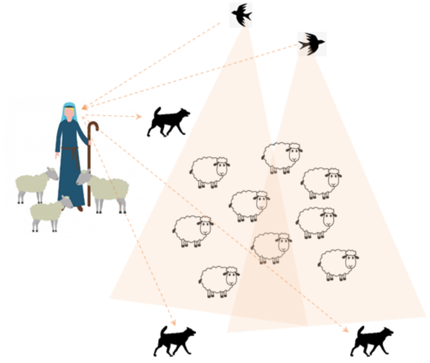

# ToDo List

1. make concept
~~1.  define  IN / OUT~~

1.  design   Archtecture

1.  Low level design

1.  check  method :  py code (shepherd ) -->  fixed name ( py  code ) file

***

# Concept Items :
- 

- Shepherd

    - shepherd :  top commander
    
      + shepherd command  :   send broadcasting message to sheep
    
    - sheep :   guide codes, tips, action items    -->  sheep (End nodes)
      + happy point :  sheep's joy
    
    - cornerstone :    set goal  as   cornerstone
    
    - dogs :    action process  to  guide  sheep direction
      
    - Info-hunting avian :  a bird that gathers information   --  action process for collecting information
 

  
# IN / OUT :

- Input  :
  + All historical data of  human activity
  + SW source code meterial
  + Test result of SW
    
- Output :
  + Human activity trend
  + Risk factor information
  + SW weak point
      + How to fix it
      + problem severity based on probability and statistical information
  + SW change trend
  

    

    
